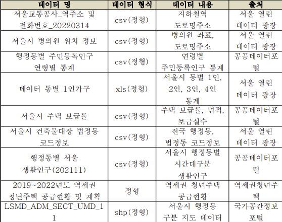
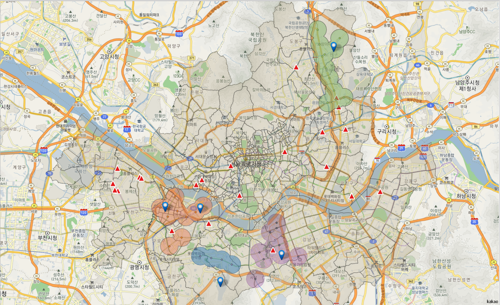

# 역세권 청년주택 최적입지선정

<div align="center">
    
  
</div>

##  About <a name = "about"></a>


##  Project structure

```
Location-Selection-for-youth-housing
 ┣ analysis
 ┃ ┗ 역세권 청년주택 최적 입지 선정.ipynb
 ┣ data
 ┃ ┣ preprocessing data/
 ┃ ┗ raw data/
 ┣ img/
 ┣ references/
 ┣ README.md
 ┣ 역세권 청년주택 입지선정.pdf
 ┗ 최종보고서.pdf
```
##  Dataset  
<div>


</div>

## Result

```
역세권청년주택 최적 입지 선정 행정동  
1순위 영등포구 여의도동  
2순위 관악구 신사동(신림4동)  
3순위 영등포구 양평2동(양평동3가)  
4순위 서초구 서초2동  
5위 노원구 상계5동
```
<div align=center>


</div>


##  ✍️ Authors
 ``곽명빈`` [@ Myungbin](https://github.com/Myungbin?tab=repositories)